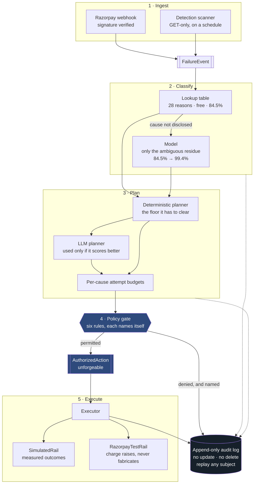

# Recoup

**An agent for failed subscription auto-debits.** It reads *why* a charge failed,
picks the intervention that matches that cause, executes it inside hard
compliance limits, and measures itself against the retry ladder it replaces.

Built for the Razorpay AI Buildathon — Track 03, AI Revenue Recovery.

> **Read the table as a model, not a bank statement.** The pipeline is real —
> Razorpay signs the webhook, the payment links are live — but *whether a
> contacted customer pays* is simulated, because Razorpay's sandbox returns one
> indistinguishable error for all eight of its documented decline scenarios.
> [What is real, and what is simulated](#what-is-real-and-what-is-simulated) is
> the honest version of this sentence, and it is worth reading before the numbers.

| Mid band, 2,000 failed charges | Baseline ladder | Recoup | |
|---|---|---|---|
| **Net recovered** | ₹18,21,720 | **₹23,10,084** | **+₹4,88,364** · +26.8% |
| **Cost of chasing** | ₹13,902 | **₹8,795** | **−₹5,107** · −36.7% |
| **Recovery rate** | 46.0% | **58.7%** | +12.7pp |
| **Customers recovered** | 878 | **1,121** | +243 |
| **Charge attempts spent** | 4,634 | **2,757** | −1,877 |
| **Wasted attempts** | 1,782 | **3** | −99.8% |

Replicates in **4 of 4** independent cohorts. Net lift clears its +15% target in
**all twelve cells** of the three-band, four-cohort grid; the worst is +21.6%.

The obvious objection is that the two arms retry on different schedules, and the
sweep never varied that. So it is taken away instead of argued about: forced onto
the baseline's own 24/48/72 ladder, leaving *channel choice* as the only
difference, **about 91% of the lift remains — +24.32% to +27.19%, in all four
cohorts** ([`evidence/schedule-ablation.md`](evidence/schedule-ablation.md), and
[D66](docs/decisions.md)).

```bash
python -m scripts.demo          # a real decline becomes a real payment link, live
python -m scripts.scan          # go looking for revenue at risk, read-only
python -m scripts.replay sub_0429 --audit-db artifacts/audit/mid/treatment.db
```

📊 **[Dashboard](site/index.html)** — the results, every test in the suite with its status from the
last run, and the failure-to-recovery flow. Rebuilt from a real run by
`python -m scripts.build_dashboard --run`; see [The dashboard](#the-dashboard).

📓 **[Decision log, 29 entries](docs/decisions.md)**

---

## The problem

When a subscription auto-debit fails, the standard response is to retry it on a
fixed schedule. The same three retries whether the customer was two hundred
rupees short, their card expired in March, or they revoked the mandate last week.

Two of those three cases cannot be fixed by retrying. The money spent trying is
gone, and in the third the customer is being charged after explicitly
withdrawing consent.

## What Recoup does differently

It classifies the root cause first, then acts on it:

```
INSUFFICIENT_FUNDS   notify → retry 24h → pay-now link 25h → retry 72h → 120h
INSTRUMENT_INVALID   ask for a new card → final notice     (never retries a dead card)
MANDATE_REVOKED      stop                                  (never charges, never messages)
TRANSIENT_ISSUER     retry 12h → 24h → 48h                 (silent; it's the bank's problem)
RISK_DECLINE         escalate to a human                   (don't argue with a fraud block)
UNCLASSIFIED         notify → retry 24h → pay-now link 25h → retry 72h → 120h
```

The baseline runs one row for **every** cause: notify, then retry at T+1, T+2,
T+3. No link, no request for a new card, and no stopping.

## What this is not

Razorpay already retries failed subscription charges, and Recoup is not a claim
that it doesn't. What it does not do is *branch on the reason*. The published
behaviour is a fixed schedule — the test-mode page documents reattempts at ten
minutes and an hour before halting, the retries page documents day-stepping with
bank holidays shifting the date — and in both, the same ladder runs whether the
customer was short of money or revoked the mandate last week. The decision the
schedule cannot make is the one this project is about.

So the delta is three things, and only three:

- **A cause is resolved before an action is chosen**, from the decline reason
  rather than from the attempt count.
- **Two causes get a channel a retry ladder has no way to offer** — a pay-now
  link for a shortfall, a card-update request for a dead instrument. Retrying
  either is spend with no mechanism behind it.
- **One cause stops the ladder entirely.** `MANDATE_REVOKED` never charges and
  never messages, which is a compliance position rather than an optimisation.

Everything else here — the retry transport, the payment links, the webhooks — is
Razorpay's, called rather than reimplemented.

---

## Architecture

Every failure — whether pushed by a webhook or found by the scanner — becomes the
same `FailureEvent`, and nothing downstream may branch on which produced it.



**The load-bearing idea is the gate.** The executor accepts exactly one type,
`AuthorizedAction`, and that type is produced only by the policy engine. Direct
construction raises, and so does `dataclasses.replace` — the route that would
have let someone forge permission *by accident* while adjusting a scheduled time.

| Layer | Package | Responsibility |
|---|---|---|
| Ingest | `recoup/ingest/` | Webhook receiver, signature verification, synthetic cohort |
| Detect | `recoup/detect/` | Scanner over three revenue-at-risk surfaces |
| Classify | `recoup/classify/` | Reason-string table, then the model for the residue |
| Plan | `recoup/plan/` | Per-cause budgets, deterministic planner, validated LLM planner |
| Police | `recoup/policy/` | The six rules and the unforgeable authorisation |
| Escalate | `recoup/escalate/` | Four tiers, advancement earned by execution, stopping rules |
| Execute | `recoup/execute/` | Payment-rail protocol, simulated rail, executor, templates |
| Record | `recoup/audit/` | Append-only log, SQLite for query, JSONL for eyeballing |
| Measure | `recoup/experiment/` | Control arm, paired harness, sensitivity sweep, replication |
| Razorpay | `recoup/razorpay/` | GET-only read client, payment-link writer, credentials |

---

## The numbers

Both arms over the same cohort, paired per-subject random draws, three
probability bands, four independent cohorts of 2,000.

### Money

|  | Baseline | Recoup | Difference |
|---|---|---|---|
| Gross recovered | ₹18,35,622 | ₹23,18,879 | **+₹4,83,257** |
| Cost of chasing | ₹13,902 | ₹8,795 | **−₹5,107** |
| **Net recovered** | ₹18,21,720 | **₹23,10,084** | **+₹4,88,364** |

**Per failed charge** — the figure that scales to your own volume, without
knowing this cohort's size:

|  | Baseline | Recoup |
|---|---|---|
| Net recovered per charge | ₹910.86 | **₹1,155.04** |
| Spent chasing per charge | ₹6.95 | **₹4.39** |

A lift of **₹244.18 per failed charge**, at 37% less spent chasing it.

### Effort

The efficiency story is attempts, not hours. Recoup spends **1,877 fewer charge
attempts** across the cohort while recovering **243 more customers** — 2.46
attempts per recovery against 5.28.

Of the baseline's 4,634 attempts, **1,782 were spent on causes a retry cannot
fix**, on subjects that never recovered. Recoup wastes **3**.

### Time

Honestly: time to recovery barely moves. **34.7h → 34.4h**, marginally faster.

That is a change worth noting only because it used to be worse. For most of this
project Recoup recovered more but **4.7 hours slower** — the probability lives in
the later retries and it went and got them. Offering a pay-now link one hour
after the first retry collects from customers who would otherwise have waited for
the day-three retry, which closed the gap. Nobody should present this as a
speed win; it is the removal of a penalty.

### Where the lift comes from

Gross recovered per cause, both arms. A total is easy to take on trust; this is
the table that says which causes earn it and which ones the agent gives up on.

| Cause | Baseline | Recoup | |
|---|---|---|---|
| `INSTRUMENT_INVALID` | ₹11,996 | **₹2,56,874** | **+₹2,44,878** |
| `INSUFFICIENT_FUNDS` | ₹10,05,017 | **₹11,93,917** | **+₹1,88,900** |
| `UNCLASSIFIED` | ₹2,83,368 | **₹3,63,836** | **+₹80,468** |
| `TRANSIENT_ISSUER` | **₹5,34,742** | ₹5,04,252 | −₹30,490 |
| `RISK_DECLINE` | **₹499** | ₹0 | −₹499 |
| `MANDATE_REVOKED` | ₹0 | ₹0 | ₹0 |

**Dead cards are where the thesis lives:** ₹11,996 against ₹2,56,874,
twenty-onefold, because Recoup asks for a new card instead of hammering one that
cannot work.

It **loses** ₹30,490 on `TRANSIENT_ISSUER` — an outage is the one cause a plain
retry ladder already suits, and Recoup spends fewer attempts on it by design. It
gives up ₹499 on `RISK_DECLINE` on purpose, because that routes to a human rather
than arguing with a bank's fraud decision. Neither is a bug; both are the cost of
a policy stated in advance.

### What actually earned it — and what the link is not responsible for

| Mechanism | Baseline | Recoup |
|---|---|---|
| `retry` | ₹18,35,622 | ₹17,36,664 |
| `pay_now_link` | ₹0 | **₹3,25,341** |
| `instrument_update` | ₹0 | **₹2,56,874** |

**That ₹3,25,341 overstates what the link added.** Credit goes to whichever
mechanism collected the payment, so a customer the link converts on day two is
credited to it even when the day-four retry would have collected the same rupees.
Measured against the identical run without the link — same seed, same cohort,
byte-identical control arm — the two eligible classes gained **₹1,87,405**. About
two-fifths of the headline is money the ladder would have earned anyway. See
[D60](docs/decisions.md).

---

## Detecting, not just being told

A webhook is a push: it reports a failure the moment it happens and nothing else.
Two of the three risk surfaces have no webhook to wait for, because *nothing
happened* is not an event. So Recoup also goes looking.

| Surface | Found by | What it yields |
|---|---|---|
| Payment failures | `subscriptions` in `pending`/`halted` | the same revenue the push reports, found without one |
| Checkout abandonment | unpaid `orders` past a threshold | see below |
| Overdue receivables | `invoices` past `due_by` | unpaid balance, detected not yet actioned |

On its first run against the live test account it found **₹3,497 at risk across
three abandoned checkouts**.

**Razorpay gives away a cause signal for free.** An order with `attempts=0` is a
customer who never tried; one with `attempts=3` tried and was declined three
times. Different problems wanting different answers. An attempted order's failed
payments are converted into a `FailureEvent` carrying the real `error_reason`,
which the existing classifier handles unchanged. An order nobody attempted is
reported as `actionable=False` **with no failure class assigned**, because nobody
declined anything and inventing a cause would be fabrication.

Every method on the read client is a GET, and a test asserts the module contains
no write verb — detection runs on a schedule against a live account, so it should
be safe without anyone reading the code to be sure.

---

## What is real, and what is simulated

**Real, against live Razorpay.** Razorpay signed a `payment.failed` event and
delivered it over the public internet to the receiver, which verified the
signature, mapped it, classified it through the model and audited it. The
signature was computed by Razorpay and accepted by our code — not, as in an
earlier run, produced and checked by the same HMAC. Detection runs against real
list queries. Payment links are created through the live API.

**Simulated, and why.** Whether a contacted customer *pays* is modelled. Razorpay
test mode cannot inject a specific decline reason — and that is measured, not
assumed. Razorpay publishes eight error-scenario test cards documented to produce
distinct error codes. **All eight were paid, each confirmed by `last4`, and every
one returned the identical generic result:**

```
error_reason  payment_failed    error_source  gateway
error_step    payment_authorization           "Payment failed"
```

Eight documented scenarios, one indistinguishable string —
[`evidence/error-card-walk.md`](evidence/error-card-walk.md). A classifier cannot
be exercised against real declines that carry no cause, which is why the cohort
injects a 25-reason mix and why **the live rail's `charge()` raises rather than
returning a plausible number.** A simulated outcome cannot enter through the path
labelled real.

Every recovery probability is therefore a declared assumption, swept across three
bands and four cohorts, and a finding is reported only if it holds in every one.

---

## Compliance

Six rules gate every action, each naming itself when it denies: contact window
(08:00–19:00 IST), template allowlist, contact rate limit, opt-out stop,
promise-to-pay suppression, per-cause attempt budget.

A blocked contact **returns to the clock at the next permitted hour** rather than
being discarded. Turning a rule about *when* to message into a rule about
*whether* is a far more expensive policy than anyone agreed to, wearing a
compliance costume — it was silently dropping 872 contacts per run before this
was found.

Every decision is appended to a log with no update path and no delete path.
`reconstruct(subscription_id)` replays any subject's whole story, including each
blocked action and the rule that blocked it:

```
classify              INSUFFICIENT_FUNDS
execute               send_message     t1_notify_email delivered
execute               retry_charge     charge declined: card_declined
contact_rescheduled   pay_now_link     rule=contact_window
                                       19:02 IST is outside 08:00-19:00 IST
execute               pay_now_link     customer paid via the pay-now link
ladder_block          —                rule=recovered
```

---

## Where the AI sits, and what it is measurably worth

The model proposes; deterministic policy disposes. A lookup table resolves 28 of
Razorpay's documented decline reasons — free, instant, and incapable of
hallucinating. Only the handful Razorpay itself documents as *not disclosing the
cause* reach the model.

| Classification, 2,000 subjects | Accuracy |
|---|---|
| Table alone | 84.5% |
| Table + model | **99.4%** |

It correctly resolves 298 declines the table refuses to guess at, on **six API
calls** — identical evidence produces identical prompts and the cache collapses
them.

**Its effect on money is weaker, and reported by the same strict rule:**

```
mean effect on net lift : +₹13,230
spread                  : −₹13,651 to +₹33,436
positive in             : 3 of 4 cohorts  →  does not replicate
```

A finding counts only if it holds in *every* cohort. The classification gain
clears that bar. The money contribution does not, and is reported as not
replicating rather than as a mean that happens to be positive. Its dead-card
contribution does clear it — positive in all twelve cells, +₹8,994 to +₹79,463.

**Everything it returns is validated before anything acts on it.** Asked to
invent a failure class, retry a dead card five times, write its own threatening
copy, or use an unregistered template, every proposal is rejected and the
deterministic planner runs instead. And since a permitted plan can still be a bad
one, its schedule is scored against the timing model — the deterministic planner
is a floor it has to clear, not merely a fallback.

---

## Running it

```bash
python -m pip install -e ".[dev]"
python -m pytest -q                       # 692 tests

python -m scripts.run_experiment --cohort-size 2000 --seed 3 \
    --replicate 11,29,47 --out-dir artifacts --freeze
```

That writes `report.md`, machine-readable `sweep.json` and `replication.json`,
and audit CSVs for both arms at all three bands. A generated copy is committed
under [`evidence/`](evidence/).

**`--freeze` registers what the run is measured against**, and not only the seed.
The configuration hash covers seed, band, cohort size and start time — none of
which is what actually moved the published numbers. A sentence added to the
planner prompt re-asked every plan and shifted dead-card money by ₹45,475 while
that hash sat unchanged. So the prompts, probability bands, budgets, costs,
cohort distribution, schedule and model name are registered too, and a later run
that differs on any of them **refuses to publish**, naming what moved:

```
refusing to run: the measurement inputs changed after freezing:
budgets.INSUFFICIENT_FUNDS, prompts.planner_user_shape
```

Re-run with `--freeze` to register the change deliberately. A measurement change
should be a visible act, not a silent one — [D62](docs/decisions.md).

**Reproducing with no API key:**

```bash
mkdir -p artifacts && cp evidence/llm_cache.json artifacts/
RECOUP_LLM_MODEL=openai/gpt-oss-120b \
  python -m scripts.run_experiment --cohort-size 2000 --seed 3 \
      --replicate 11,29,47 --out-dir artifacts
```

The cache is keyed by a hash of `model | system | user | max_tokens`, which is
why the model must be named. Verified with every provider key unset: the sweep
and replication come back **byte-identical** to the committed bundle.

### Bring your own model

Set one key and Recoup picks the provider up automatically. Free tiers are
preferred over paid ones.

| Provider | Env var | Free tier | Default model |
|---|---|---|---|
| Groq | `GROQ_API_KEY` | yes, no card | `openai/gpt-oss-120b` |
| Google AI Studio | `GEMINI_API_KEY` | yes, no card | `gemini-2.0-flash` |
| OpenRouter | `OPENROUTER_API_KEY` | yes, `:free` models | `meta-llama/llama-3.3-70b-instruct:free` |
| Together | `TOGETHER_API_KEY` | yes | `Llama-3.3-70B-Instruct-Turbo-Free` |
| xAI | `XAI_API_KEY` | paid | `grok-2-latest` |
| Anthropic | `ANTHROPIC_API_KEY` | paid | `claude-sonnet-5` |
| OpenAI-shaped | `OPENAI_API_KEY` + `OPENAI_BASE_URL` | — | `gpt-4o-mini` |

Temperature is pinned to zero everywhere. A weaker model degrades the *quality*
of a suggestion; it cannot degrade the *safety* of an action, because every
output is validated against closed enums before anything acts on it.

For the live Razorpay path, see
[`docs/runbooks/razorpay-test-mode.md`](docs/runbooks/razorpay-test-mode.md).

---

## What it took to get here

An earlier version of this README reported Recoup **losing** 2.26% of gross
recovery, and the honest account of how it got from there to here is the
[decision log](docs/decisions.md) — 29 entries, including every defect found in
the measurement pipeline itself.

The pattern across them is worth stating plainly: **every serious defect this
project found was in the measurement, not the product.** Four of them, and each
shares a shape — the claim was *true when written* and stopped being true without
anything failing:

1. **The experiment ran with the model disconnected.** 930 of 1,542 ambiguous
   classifications never reached a model, and the degraded run scored *higher*.
   The runner now refuses to publish a bundle if any prompt reached neither cache
   nor model.
2. **The audit log accumulated across runs.** A published CSV held six runs at
   once. Metrics came from memory so the headline numbers were never wrong, but
   the evidence offered for them was unreadable.
3. **"Reproduce with no API key" had been broken since the provider changed.**
   True when written, silently invalidated, checkable by nobody.
4. **The configuration freeze did not cover the prompts.** It certified a run
   whose planner prompt had been rewritten — a guarantee a reader could point at,
   which is worse than none.

The fix in every case was the same move: make the claim executable rather than
asserted. A recorded fixture instead of a comment, a runner that refuses to publish
a degraded bundle, a freeze that registers the prompts it was silently ignoring.

A later review found three more, and they are a different kind: nothing had
broken, and nothing published was false. What was missing was disclosure. The two
arms retried on different schedules and the sweep never varied it ([D66](docs/decisions.md));
the probability model both selects the plan and draws the outcome ([D67](docs/decisions.md));
and the classifier's accuracy is measured on a reason mix roughly six times less
ambiguous than the one Razorpay actually sends ([D68](docs/decisions.md)). Two of
the three are now runnable rather than argued —
[`scripts/ablate_schedule`](scripts/ablate_schedule.py) and
`tests/classify/test_ambiguity_gap.py` — and the third is written down where a
reader will hit it. A result that survives being attacked is worth more than one
that was never tested; the ablation is in the repo precisely because it could
have gone the other way.

Budgets were widened once *after* seeing a loss, which is exactly what
pre-registration guards against; that is disclosed as D40, and the one budget
change since was made and written down **before** re-measuring.

The habit predates the defects. **The second commit in this repository — before the
domain models, before any recovery logic — was the decision log itself**
(`361da51`, 25 Aug).

---

## The dashboard

`site/index.html` is generated, not written. It is rebuilt from a real test run, and the status
beside every test comes from the JUnit XML pytest itself wrote — so the only way to make the page
say a test passes is for that test to pass.

```bash
python -m scripts.build_dashboard --run tests/classify tests/policy   # 121 tests, ~2s
python -m scripts.build_dashboard --run                               # all 692, ~115s
python -m scripts.build_dashboard                                     # reuse evidence/junit.xml
```

**A partial run says so.** The build always collects the full inventory, so tests outside the run
are marked *not in this run* rather than shown green, and the banner names how many were skipped.
The 121-test pair above is the fast one to run live in front of an audience: it covers cause
resolution and all six policy rules — the two claims worth showing being checked — and the page
is honest that the other 571 did not run.

The money figures still come from the committed bundle rather than being recomputed, so the
generator cannot flatter the experiment. Same contract as `build_console.py`.

## Hosting

The dashboard is one static file with no build step, so Vercel needs no framework and no
install. `vercel.json` points it at `site/`, which holds nothing but the page.

```bash
npx vercel login          # once, interactive
npx vercel --prod         # from the repo root
```

Or import `distinguishedape/recoup` at [vercel.com/new](https://vercel.com/new) and accept the
defaults — `vercel.json` supplies them. If the import screen asks anyway, the answers are
Framework **Other**, Build Command **none**, Output Directory **`site`**. Every push to `main`
then redeploys.

Nothing else in the repo is served: the deployment contains `site/` and no other directory.

## Layout

| Path | What's in it |
|---|---|
| `recoup/` | The pipeline — see the architecture table above |
| `scripts/` | `demo`, `scan`, `replay`, `run_experiment`, `ablate_schedule`, `build_console`, `build_dashboard` |
| `tests/` | 692 tests, including a conformance test over every payment rail |
| `evidence/` | The generated bundle: report, sweep, replication, audit CSVs, console, schedule ablation |
| `docs/decisions.md` | Every problem hit, what was chosen, and what it costs if wrong |
| `site/index.html` | The dashboard — generated by `scripts/build_dashboard.py` from a real test run |
